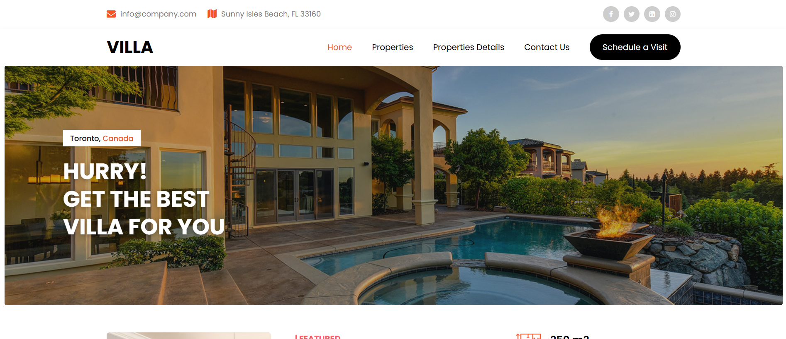
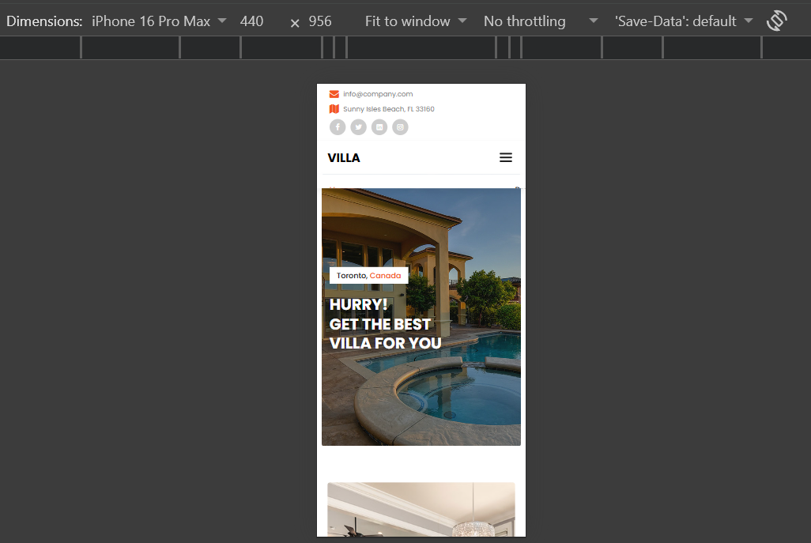

# 🏡 Villa Website – Responsive Frontend

A modern and responsive **Villa website frontend template** developed using **HTML5 and CSS3**. This project is a frontend design clone inspired by a villa/property website, created to practice and demonstrate responsive web design and frontend development skills.

## 📌 About the Project

The Villa Website is a static frontend project that provides a clean and visually appealing interface for showcasing villas and property-related information.

The main focus of this project was to recreate a professional property website layout while ensuring that the design works smoothly across different screen sizes and devices.

## ✨ Features

* 🏡 Modern villa/property website design
* 📱 Fully responsive layout
* 💻 Compatible with desktop, tablet, and mobile screens
* 🎨 Clean and attractive user interface
* 🧩 Well-structured HTML
* 🎯 Custom CSS styling
* ⚡ Lightweight and fast frontend
* 📐 Responsive sections and layouts
* 🌐 Cross-device compatible design

## 🛠️ Technologies Used

* **HTML5** – Used to structure the website
* **CSS3** – Used for styling, layouts, responsiveness, and visual design

## 📂 Project Structure

```text
Villa-Website/
│
├── index.html
├── style.css
├── images ...
├── screenshots
└── README.md
```

## 🚀 Getting Started

To run this project locally:

1. Clone the repository:

```bash
git clone https://github.com/your-username/your-repository-name.git
```

2. Open the project folder.

3. Open `index.html` in your browser.

No additional frameworks, libraries, or installations are required.

## 🎯 Purpose

This project was created as a **frontend development practice project** to improve my skills in:

* HTML5
* CSS3
* Responsive Web Design
* Website Layout & Structure
* UI Design
* Cross-device compatibility

## 📸 Project Preview

### Desktop View



### Mobile View



## 👨‍💻 Author

**Hammad Ilyas**

This project is part of my frontend web development learning journey.

